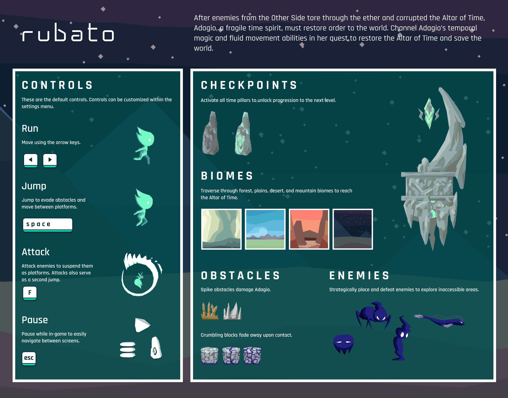

<!-- Most recent release file -->

 

# Rubato by Glassbox Games

**[Download for Windows](https://github.com/glassboxgames/rubato-releases/raw/main/docs/rubato.exe.zip)**  
**[Download for Mac OS X](https://github.com/glassboxgames/rubato-releases/raw/main/docs/rubato.app.zip)**  
*Updated 05/22/2020*  
Click [here](pre-releases/) for previous releases   

___

Navigate menus with the mouse.  

## Play Mode
- Move left and right with the arrow keys (default)
- Jump with the spacebar (default)
- Attack with the F key (default)
- Pause with ESC
- Activate a time pillar by moving past it
- Continue to the next level by moving past the right edge of the screen

Touching a moving enemy will result in death.  
Attacking a moving enemy will suspend it, at which point the player can safely touch and jump on it.

## Cutscene Mode
- Pause scrolling with the jump key
- Accelerate or reverse scrolling with the left and right keys
- Go back to level selection with ESC

## Editor mode
- Left click any of the buttons to start placing that element
- Right click to cancel placement or delete the element under the cursor
- Hold shift to snap to tile
- Move the camera with WASD
- Playtest the level with P
- Return to the editor with ESC

## Settings
- Click on a current binding and press a key to rebind Adagio's character controls

# Contributors
Akane Edwards, Benjamin Shen, Catie Rencricca, Jackie Zheng, Kenneth Li, Kevin Sun, Will Gao, Yanlam Ko, *Jacob Nannapanenni*, *Nathaniel Watson*

[Github](https://github.com/glassboxgames/rubato)
